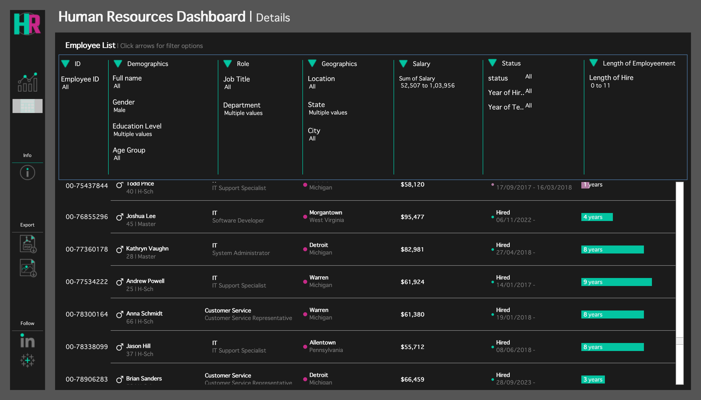

# HR Analytics Dashboard

## Project Overview

This project is an interactive HR Analytics Dashboard built using Tableau. It analyzes workforce demographics, hiring trends, employee distribution, education, performance, and attrition to support data-driven HR decisions.

---

## Tools Used

- Tableau
- CSV Dataset

---

## Dataset

The dataset contains employee information including:

- Employee ID
- Gender
- Department
- Job Title
- Age
- Education
- Hire Date
- Termination Date
- Performance Rating
- Location

---

## Dashboard Preview

### HR Summary

### HR Details

---

## Key Metrics

- Total Employees
- Active Employees
- Terminated Employees
- Hiring Trend
- Gender Distribution
- Department-wise Employees
- Education Analysis
- Performance Analysis

---

## Dashboard Features

- Interactive dashboard
- Department-wise employee analysis
- Hiring and termination trends
- Employee demographics
- Geographic distribution
- Interactive filters

---

## Business Questions Answered

- What is the total number of active employees?
- Which departments have the highest employee count?
- How has hiring changed over time?
- What is the gender distribution across the company?
- How are employees distributed by age and education?
- Which education levels are associated with different performance ratings?
- What are the termination trends?

---

## Repository Contents

- `HR_Analytics_Dashboard.twbx`
- `HR_Dataset.csv`
- `HR Summary.png`
- `HR | Details.png`

---

## Live Dashboard

View the interactive dashboard here:

[Tableau Public](https://public.tableau.com/app/profile/anish.singh6258/viz/HRDashboardproject_17826777784450/HRSummary)

---

## Future Improvements

- Connect to SQL database.
- Automate data refresh.
- Develop a Power BI version.
